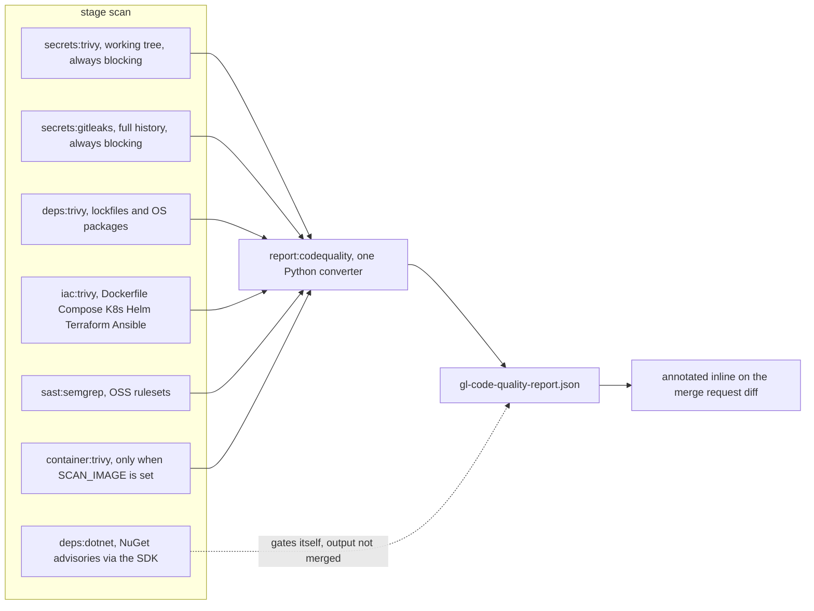

# ci-templates

Shared GitLab CI templates for a self-hosted **GitLab Community Edition** instance. One file
does the work: `security.gitlab-ci.yml` gives a CE project secret detection, dependency
scanning, IaC scanning and SAST, built entirely from open-source scanners, with the findings
rendered inline on the merge-request diff.

It exists because GitLab's own `Security/*.gitlab-ci.yml` templates do not usefully work on
CE, and the reason is not the one people expect. Two separate things are gated. **The
analyzers**: SAST and Secret Detection run on Free and CE, Dependency Scanning, Container
Scanning and License Scanning do not. **The rendering**: the merge-request security widget,
the Vulnerability Report and the Security Dashboard are all Ultimate. So even for the
analyzers that do run, you can produce a perfectly valid `gl-sast-report.json`, upload it via
`artifacts:reports:sast`, and find that nothing anywhere in the UI ever shows it. The keyword
is accepted. The report is stored. It is simply never displayed.

The result is the worst configuration available: a pipeline that looks instrumented, jobs that
take minutes, and findings that exist only in a job log nobody opens.

(Tiering moves between releases — check your own instance. The shape of the argument holds:
on CE, assume report *rendering* is the thing you do not have.)

## The pipeline



Every arrow into `report:codequality` is `needs: optional: true`. Several scan jobs are
conditional — `deps:dotnet` only where a `.csproj` exists, `container:trivy` only where
`SCAN_IMAGE` is set — and without `optional`, a skipped dependency makes the report job
unresolvable and GitLab refuses to start the pipeline at all. Every job also carries
`artifacts: when: always`, because a job that *fails* on a finding still has to upload it.

## Code Quality is the report CE renders

This is the design decision the whole template turns on. Code Quality is available on
Free and CE, and it renders **inline on the merge-request diff**, annotated on the exact line,
next to the change that introduced the problem. It is a generic format, and nothing in it says
the issues have to come from a linter.

So every scanner's output is converted into one Code Quality report:

```json
{
  "type": "issue",
  "description": "CVE-2024-0002: minimist 1.2.0 — Arg injection (no fix available)",
  "check_name": "CVE-2024-0002",
  "severity": "blocker",
  "fingerprint": "f24979add06b948deb5b046857f81b1ac42ba829410c37b5b7c3f3f259d4573b",
  "location": { "path": "package-lock.json", "lines": { "begin": 1 } }
}
```

**One merge job, not one report per scanner.** GitLab merges Code Quality reports across jobs,
so per-scanner reports would technically work. They are the wrong shape for a practical reason
and a design reason. Practically: the scanner images are minimal Alpine and none of them ship
`jq`, so each job would need its own tool install and its own copy of the conversion logic. By
design: severity mapping and de-duplication are *decisions*, and decisions belong in one place.
Trivy's secret scanner and Gitleaks will find the same credential; something has to notice.

**Fingerprints are a hash of a composite natural key** — target, rule id, package, line — so
they are stable across runs and change only when the finding genuinely changes. That is how
GitLab distinguishes a new finding from one that was already there.

**Severity mapping is policy, not a lookup.** Trivy's CRITICAL/HIGH/MEDIUM/LOW maps onto
blocker/critical/major/minor cleanly enough. Secrets do not, and they are pinned at `blocker`
unconditionally. A CVE with no available patch is a risk you carry deliberately; a leaked
credential is not a risk at all, it is a task. Ranking them on one scale is the small
dishonesty that makes a vulnerability list feel like weather.

## The gate

Secret detection blocks unconditionally. Everything else is report-only by default:

```yaml
variables:
  SECURITY_FAIL_ON: ''      # blocker | critical | major | minor | info
```

Turn on dependency scanning at HIGH against a codebase that has never been scanned and every
pipeline goes red on day one over transitive CVEs in packages nobody chose. Within a week the
team has learned that red means nothing and `allow_failure: true` shows up in a commit titled
"unblock CI". You have spent your credibility and bought negative security. Report-only first,
triage once, then tighten and mean it.

Secrets are the exception because the response is not a judgement call. There is no backlog of
credentials you are choosing to live with — each one is a revocation, and the work is bounded.

## Use it

```yaml
include:
  - project: 'john-naeder/ci-templates'
    ref: main
    file: '/security.gitlab-ci.yml'

stages: [scan, report]
```

Until this project exists on your GitLab, vendor the file instead:

```yaml
include:
  - local: '.gitlab/ci/security.yml'
```

Jobs run on merge requests, on the default branch, on tags, and on scheduled pipelines.

### Variables

| Variable | Default | Meaning |
|---|---|---|
| `SECURITY_FAIL_ON` | empty | Minimum severity that fails the report job. Empty is report-only. Secret detection ignores this and always blocks. |
| `SECURITY_SCAN_DISABLED` | unset | Set to anything to skip every job. |
| `SCAN_IMAGE` | unset | Image reference for `container:trivy`. |
| `TRIVY_DB_REPOSITORY` | upstream | Point at a Harbor proxy cache for an air-gapped runner. |
| `GIT_DEPTH` | `0` | Load-bearing. GitLab's default of 20 means Gitleaks faithfully scans the last twenty commits and reports a clean repository. |
| `TRIVY_IMAGE`, `GITLEAKS_IMAGE`, `SEMGREP_IMAGE`, `PYTHON_IMAGE` | pinned | Bump as a reviewed change. |

Two secret scanners is not redundancy: Trivy scans the working tree, Gitleaks walks every
commit. A credential deleted in a later commit is invisible to the first, obvious to the
second, and still served to everyone who clones.

`deps:dotnet` exists because Trivy has a real blind spot. It resolves NuGet dependencies from
`packages.lock.json`, and most .NET repositories do not commit one — it is opt-in behind
`RestorePackagesWithLockFile`. Trivy therefore reports zero findings on a solution with a
hundred transitive packages, and zero reads as "clean". The SDK already knows the graph, so the
job asks it.

### Runner notes

- The runner needs to pull the scanner images, or have them mirrored.
- The Trivy DB cache key is branch-agnostic, so the first job of a pipeline pays the few
  hundred megabytes once.
- Give the scan jobs a memory limit on the Kubernetes executor. Semgrep on a repository of any
  size will exceed the modest default a `[runners.kubernetes]` block tends to carry, and an OOM
  inside Semgrep looks like a mysterious exit rather than an OOM.
- Add a pipeline schedule on the default branch. Advisory databases change even when the code
  does not; every job already has a `$CI_PIPELINE_SOURCE == "schedule"` rule.

## The wart, and how it is contained

`include:` brings YAML, not files, so the converter — 204 lines of Python — is embedded in the
template as a heredoc. This is not lovely. The alternatives are worse for a first setup:
fetching the script at runtime adds a network dependency and an auth story, and a
multi-project checkout means every consuming project needs read access to the template project.
Inlining keeps the template includable on its own with nothing else to configure.

The mitigation is that the embedded copy is *generated*, not pasted.
`scripts/to-codequality.py` is the source of truth:

```bash
python3 scripts/sync-template.py     # re-embeds it into security.gitlab-ci.yml
```

Which leaves the question of whether the embedded copy matches. That is testable by reversing
the generation: parse the YAML, pull out `.codequality_converter.script[0]`, run it in an empty
directory, and diff the file it writes against the source. Then run the extracted copy against
synthetic output from all five input formats and check the gate behaves — exit 0 with
`SECURITY_FAIL_ON` empty, exit 1 at `critical`, correct de-duplication and ordering.

The converter runs locally too, against any scanner output in the current directory:

```bash
trivy fs --scanners vuln,secret,misconfig --format json --output trivy-fs.json .
semgrep scan --config auto --json --output semgrep.json
gitleaks detect --source . --report-format json --report-path gitleaks.json --exit-code 0
SECURITY_FAIL_ON=critical python3 scripts/to-codequality.py
```

## Limits

- **`deps:dotnet` is not wired into the report.** It writes `dotnet-vulnerable.txt`, greps its
  own output to decide whether to fail, and is absent from `report:codequality`'s `needs`. Its
  findings never reach the merge-request diff. The converter reads `trivy-*.json`,
  `semgrep.json` and `gitleaks.json` only.
- **No dashboard, no cross-project trend, no "accept this risk until March" workflow.** Those
  are the genuinely valuable parts of the Ultimate offering and this does not replace them. It
  replaces the *detection*, which was always the commodity half.
- **Images are pinned by tag, not digest.** A scanner that silently changes version is a
  scanner whose findings you cannot compare over time. Digests once the images are mirrored.
- **De-duplication is within one pipeline run.** There is no memory of what was triaged last
  week; that is what the Vulnerability Report would have given you.

For one engineer and a handful of repositories, findings annotated on the diff of the merge
request that introduced them is most of the value anyway. It puts the finding in front of the
person who caused it, at the moment they can most cheaply fix it, which is the only property of
a security tool that reliably changes behaviour.
